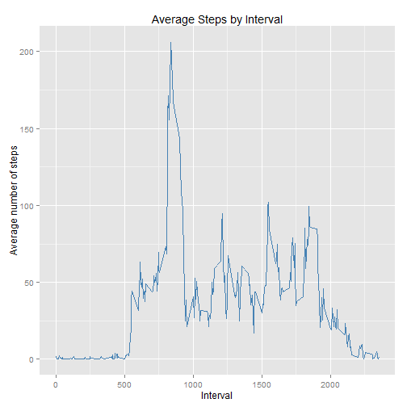
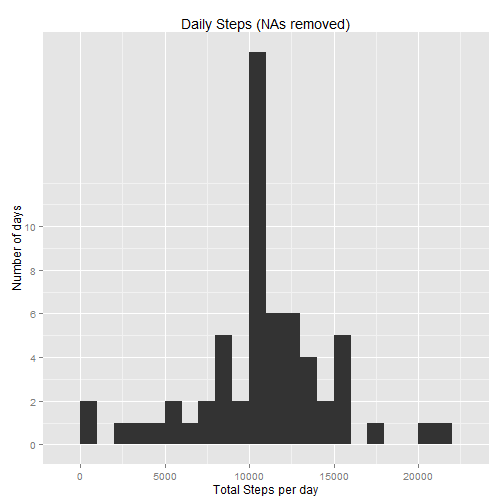

## Loading and preprocessing the data

1. Load the data (i.e. `read.csv()`)


```r
activity<-read.csv("activity.csv",stringsAsFactors=FALSE)
```

2. Process/transform the data (if necessary) into a format suitable for your analysis


```r
# Convert the date column from a character type to an appropriate date format
activity$date<-strptime(activity$date,"%Y-%m-%d")
```


## What is mean total number of steps taken per day?

1. Make a histogram of the total number of steps taken each day


```r
library(plyr)
library(ggplot2)

agg1<-ddply(activity,.(date),summarize,steps=sum(steps,na.rm=T))

ggplot(agg1,aes(x=steps))+scale_y_continuous(breaks=seq(0,10,by=2))+
  ylab("Number of days")+xlab("Steps per day")+ggtitle("Daily Steps")+geom_histogram(binwidth=1000)
```

 

2. Calculate and report the **mean** and **median** total number of steps taken per day


```r
with(agg1,data.frame(mean=mean(steps),median=median(steps)))
```

```
##      mean median
## 1 9354.23  10395
```


## What is the average daily activity pattern?

1. Make a time series plot (i.e. `type = "l"`) of the 5-minute interval (x-axis) and the average number of steps taken, averaged across all days (y-axis)


```r
agg2<-ddply(activity,.(interval),summarize,mean_steps=mean(steps,na.rm=TRUE))

ggplot(agg2,aes(x=interval,y=mean_steps))+ggtitle("Average Steps by Interval")+
  ylab("Average number of steps")+xlab("Interval")+geom_line(colour="steelblue")
```

 

2. Which 5-minute interval, on average across all the days in the dataset, contains the maximum number of steps?


```r
agg2[agg2$mean_steps==max(agg2$mean_steps),]
```

```
##     interval mean_steps
## 104      835   206.1698
```


## Imputing missing values

1. Calculate and report the total number of missing values in the dataset (i.e. the total number of rows with `NA`s)


```r
table(is.na(activity$steps))["TRUE"]
```

```
## TRUE 
## 2304
```

2. Devise a strategy for filling in all of the missing values in the dataset. The strategy does not need to be sophisticated. For example, you could use the mean/median for that day, or the mean for that 5-minute interval, etc.

**Strategy:** I'll use mean for 5-minute intervals which have been computed in the previous task.

3. Create a new dataset that is equal to the original dataset but with the missing data filled in.


```r
activity_bis<-activity

# I'll use the data frame agg2 prepared in the previous task
activity_bis<-merge(agg2,activity_bis,by="interval",all=TRUE)

activity_bis$steps<-with(activity_bis,ifelse(is.na(steps),mean_steps,steps))

activity_bis$mean_steps<-NULL
```

4. Make a histogram of the total number of steps taken each day and Calculate and report the **mean** and **median** total number of steps taken per day. Do these values differ from the estimates from the first part of the assignment? What is the impact of imputing missing data on the estimates of the total daily number of steps?


```r
agg3<-ddply(activity_bis,.(date),summarize,steps=sum(steps))

ggplot(agg3,aes(x=steps))+scale_y_continuous(breaks=seq(0,10,by=2))+
  ylab("Number of days")+xlab("Total Steps per day")+ggtitle("Daily Steps (NAs removed)")+geom_histogram(binwidth=1000)
```

 

```r
with(agg3,data.frame(mean=mean(steps),median=median(steps)))
```

```
##       mean   median
## 1 10766.19 10766.19
```
  
**Answer:** The above numbers differ, they'e now larger as because NAs were replaced with certain numbers.


## Are there differences in activity patterns between weekdays and weekends?

1. Create a new factor variable in the dataset with two levels -- "weekday" and "weekend" indicating whether a given date is a weekday or weekend day.


```r
# To be sure that the names of days are in English
Sys.setlocale("LC_TIME", "English") 
```

```
## [1] "English_United States.1252"
```

```r
activity$dow<-as.factor(ifelse(weekdays(activity$date,abbreviate=T) %in% c("Sat","Sun"),"weekend","weekday"))

# Confirm by displaying first rows
head(activity)
```

```
##   steps       date interval     dow
## 1    NA 2012-10-01        0 weekday
## 2    NA 2012-10-01        5 weekday
## 3    NA 2012-10-01       10 weekday
## 4    NA 2012-10-01       15 weekday
## 5    NA 2012-10-01       20 weekday
## 6    NA 2012-10-01       25 weekday
```

2. Make a panel plot containing a time series plot (i.e. `type = "l"`) of the 5-minute interval (x-axis) and the average number of steps taken, averaged across all weekday days or weekend days (y-axis).


```r
agg4<-ddply(activity,.(dow,interval),summarize,mean_steps=mean(steps,na.rm=TRUE))

ggplot(agg4,aes(x=interval,y=mean_steps,colour=agg4$dow))+ggtitle("Average Steps by Interval")+
  ylab("Average number of steps")+xlab("Interval")+facet_grid(dow~.)+geom_line()
```

 
